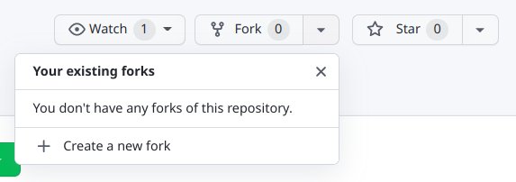
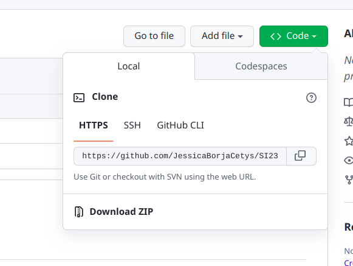

# SI23

## Prerequisitos
Tener instalado:
- [anaconda](https://www.anaconda.com/)
- [git](https://git-scm.com/book/en/v2/Getting-Started-Installing-Git)

## Instrucciones
1. Crea un ambiente e instala las dependencias adecuadas corriendo los siguientes comandos
```
conda create -n sistemas_inteligentes python=3.8
conda activate sistemas_inteligentes
pip install -e .
```
2. Haz un fork de este repositorio. Define el nombre como SI23_[nombre_de_equipo]

3. Ve a tu nuevo repositorio y copia el link en code->Local-> HTTPS

4. Clona tu forked repo localmente
```
git clone [http link]
```
5. Agrega el repositorio original como upstream

```
git remote set-url upstream https://github.com/JessicaBorja/SI23.git
```

## Actualizar tu repositorio
Para actualizar tu repositorio local con los cambios del remoto ejecuta los siguientes comandos.

### Sincronizar repo local con remoto
### (Local -> Remoto)
Para mandar a github los commits que tengas localmente que no estén en el repositorio remoto, escribe en tu consola de comandos dentro de tu repositorio local:

```
git push
```

### (Remoto -> local)
Para traer a tu repositorio local los commits que se encuentran en el repositorio remoto, escribe en tu consola de comandos dentro de tu repositorio local:

```
git pull
```

### Sincronizar repo local y remoto con el upstream (original)
Los siguientes comandos:

1. (fetch) Buscan los cambios en el upstream
2. (rebase) Integran los cambios del upstream a tu repositorio local
3. (push) Sincronizan los cambios del repositorio local (que vienen del upstream) a tu repositorio remoto en github

```
git fetch upstream
git rebase upstream/master
git push
```
